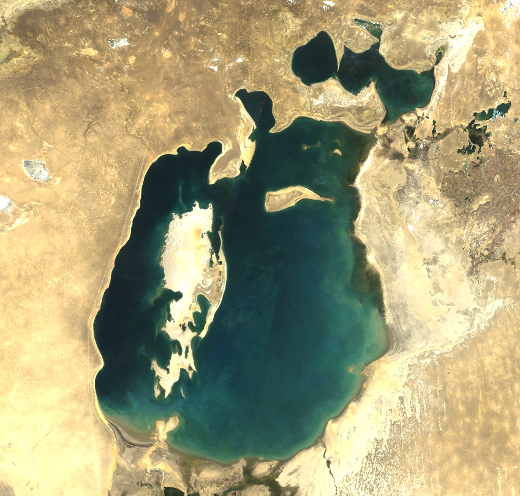
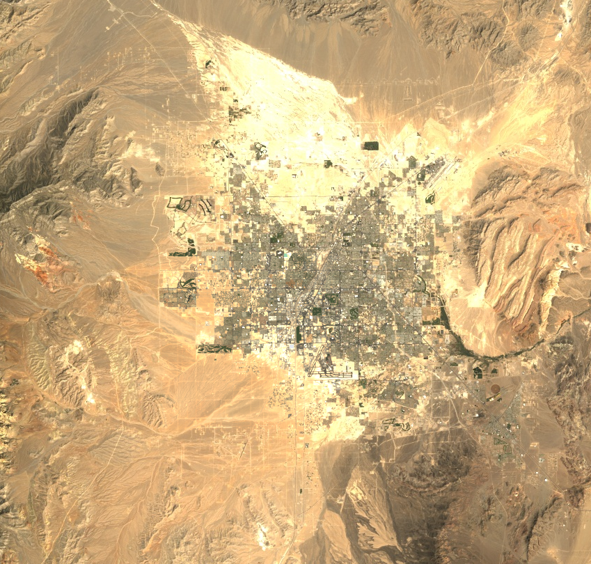
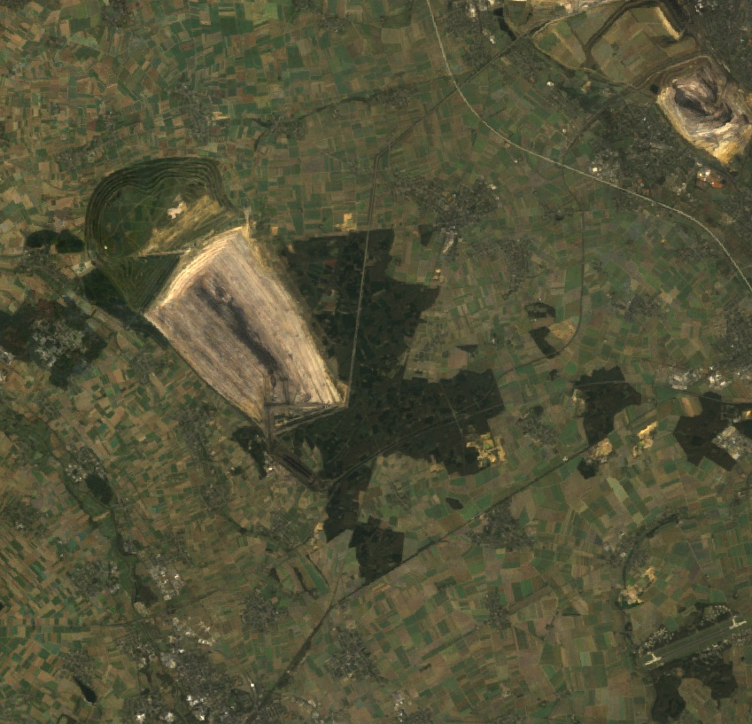
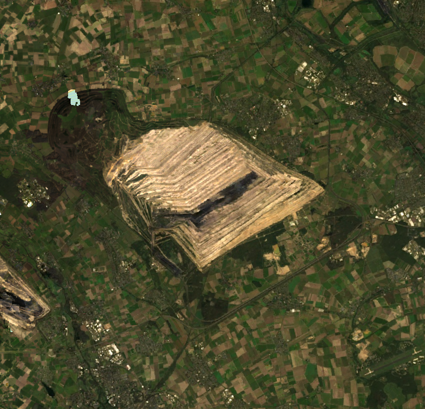
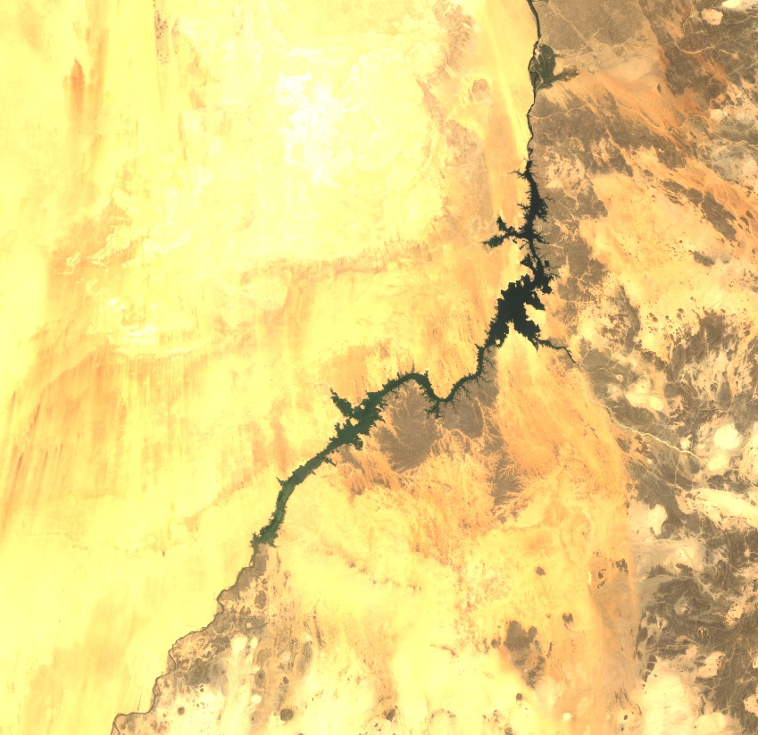
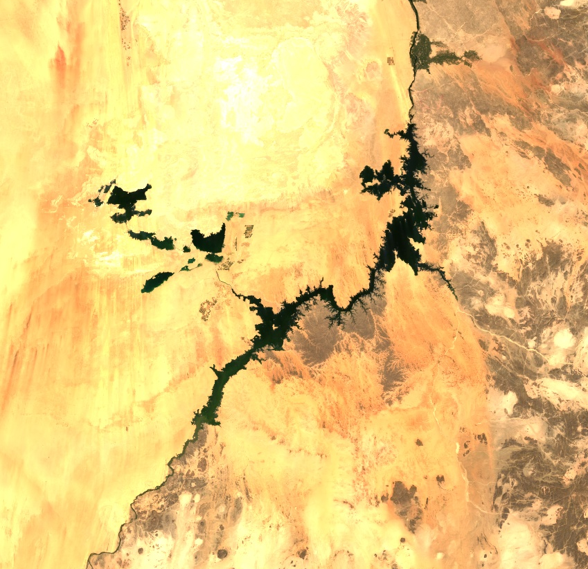

# Our changing planet

Humanity changes the face of the Earth as well as its atmosphere. These changes have significant impact, amongst others, on ecosystems, biodiversity, climate and other humans.

Satellite images, such as those from the [Landsat](https://landsat.gsfc.nasa.gov/) missions, enable us to make these changes visible and monitor their development over time - for better or worse.

Kurzgesagt made a fascinating [video](https://www.youtube.com/watch?v=LEENEFaVUzU) on humanity recently. In a nutshell:

- Modern humans arose some 200,000 years ago.
- Since then about 117 billion people lived and died.
- The 8 billion people alive on the planet today represent 7% of all humans that have ever lived - as many as were born in the first 150,000 years of human history.
- The UN estimates that our numbers peak at 11 billion in 2100.

Where does this leave us now? Well, instead of thinking of us being at the end, we could also see us as just at the beginning of human history with almost unfathomable numbers of humans yet to be born in the future.

It is thus our responsibility today to preserve planet Earth for all those humans that are yet to be born in the future to have a chance for a good life as well.

Below are a couple of examples of how humans changed planet Earth in the past 30 years from 1991 to 2021, including drying lakes, urban growth, deforestation, agriculture, mining, and creating artificial lakes.

### Inspiration

- [Earth Then and Now](https://www.goodreads.com/book/show/27303880-earth-then-and-now) by Fred Pearce
- [The Last Human – A Glimpse Into The Far Future](https://www.youtube.com/watch?v=LEENEFaVUzU) by Kurzgesagt
- [Google Earth Engine Timelapse](https://earthengine.google.com/timelapse)

### Data

- [Google Earth Engine Landsat Collection](https://developers.google.com/earth-engine/datasets/catalog/landsat)
- 1991: Landsat 5, surface reflectance, true color (RGB), yearly median composite, 30 m resolution
- 2021: Landsat 8, surface reflectance, true color (RGB), yearly median composite, 30 m resolution

## Drying of Aral Sea, Kazakhstan and Uzbekistan

<table>
	<tr>
		<th>1991</th>
		<th>2021</th>
	</tr>
	<tr>
		<td>  </td>
		<td>  </td>
	</tr>
</table>

## Urban growth in Las Vegas, United States

<table>
	<tr>
		<th>1991</th>
		<th>2021</th>
	</tr>
	<tr>
		<td>  </td>
		<td>  </td>
	</tr>
</table>

## Deforestation in Rio Branco, Brasil

<table>
	<tr>
		<th>1991</th>
		<th>2021</th>
	</tr>
	<tr>
		<td>  </td>
		<td>  </td>
	</tr>
</table>

## Agriculture in Wadi As Sirhan, Saudi Arabia

<table>
	<tr>
		<th>1991</th>
		<th>2021</th>
	</tr>
	<tr>
		<td>  </td>
		<td>  </td>
	</tr>
</table>

## Coal mining in Hambacher Forst, Germany

<table>
	<tr>
		<th>1991</th>
		<th>2021</th>
	</tr>
	<tr>
		<td>  </td>
		<td>  </td>
	</tr>
</table>

## Man-made Lake Nasser as a consequence of constructing the Aswan High Dam, Egypt

<table>
	<tr>
		<th>1991</th>
		<th>2021</th>
	</tr>
	<tr>
		<td>  </td>
		<td>  </td>
	</tr>
</table>