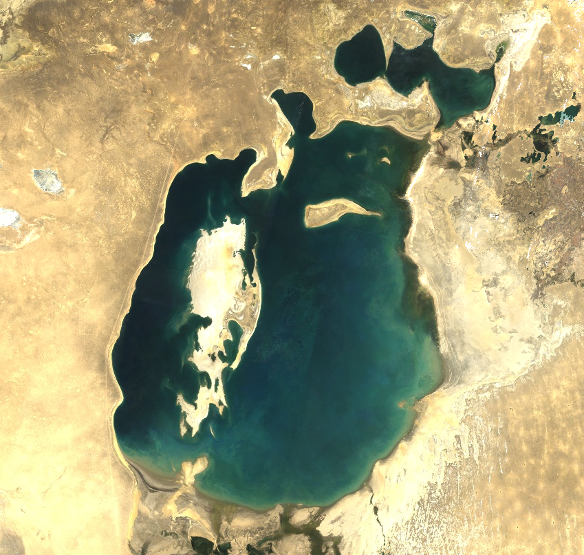
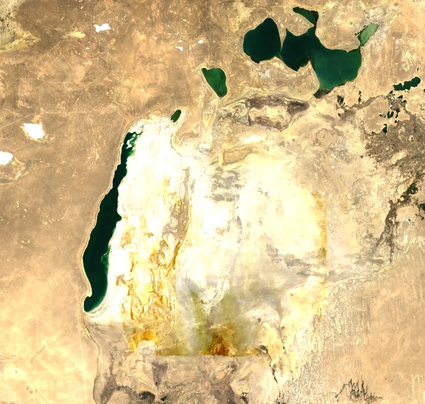
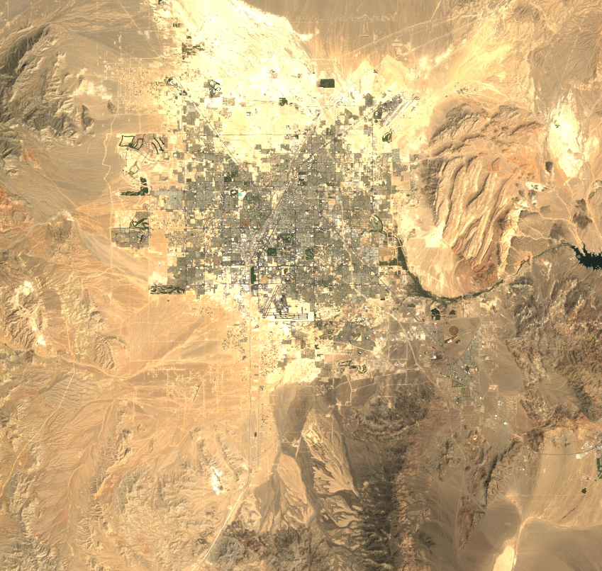
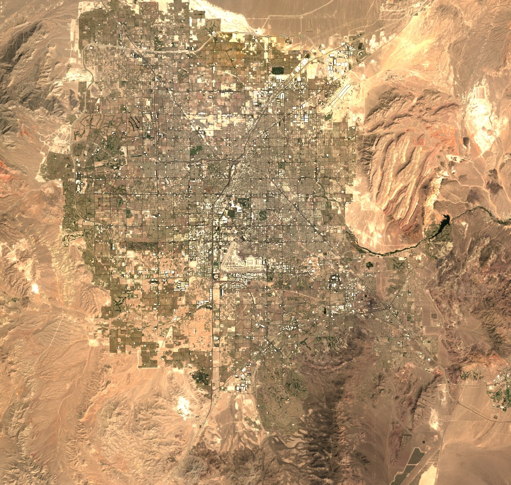
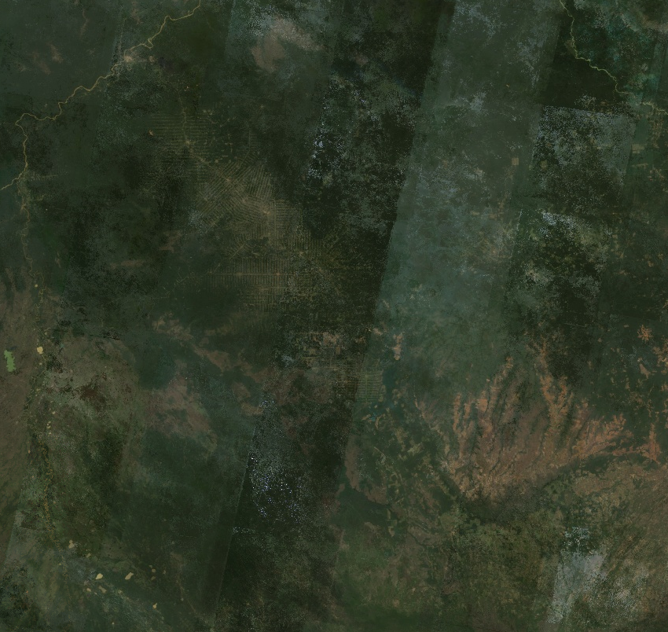
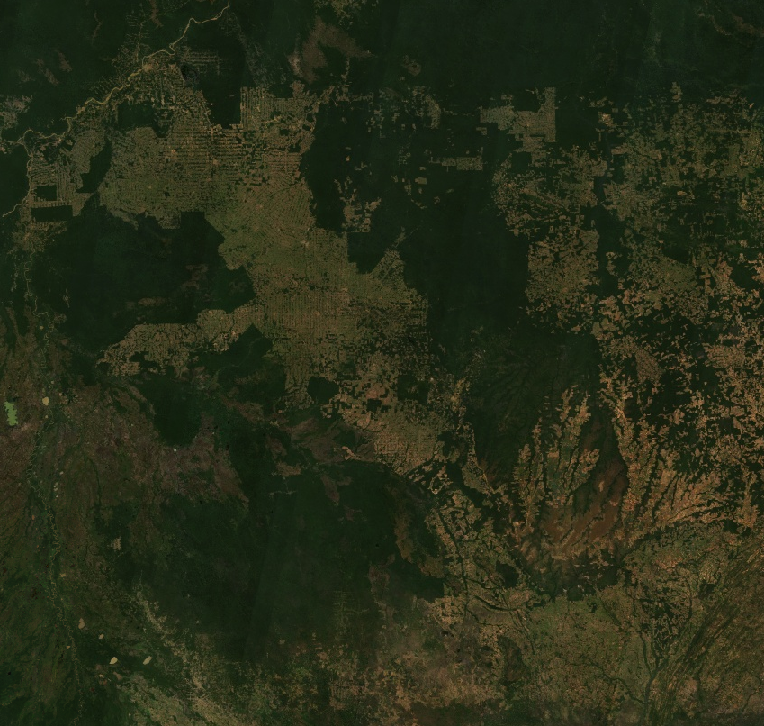
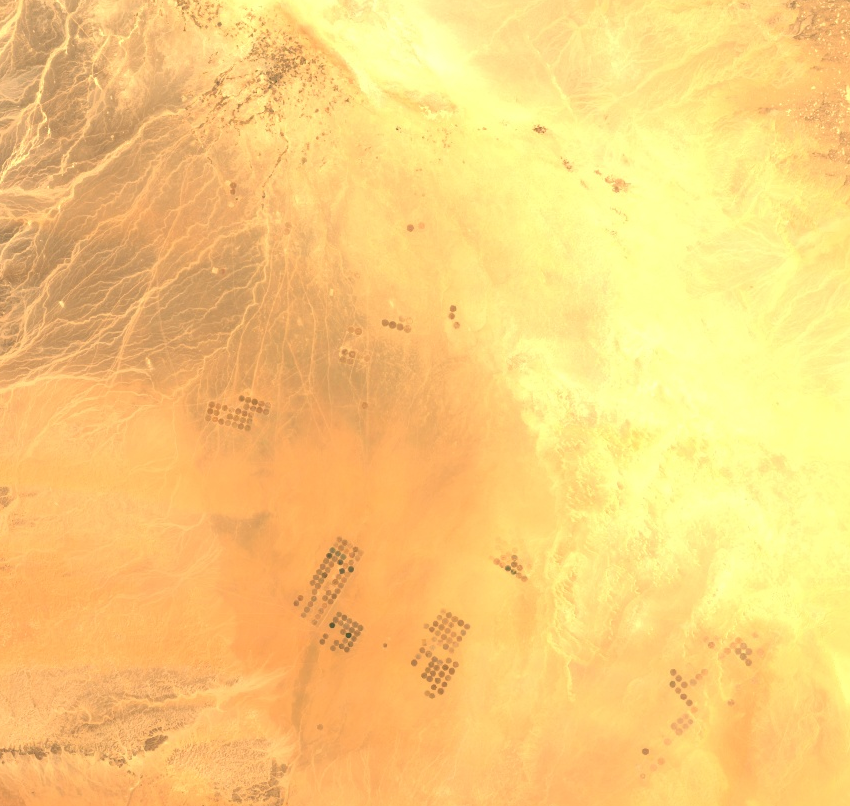
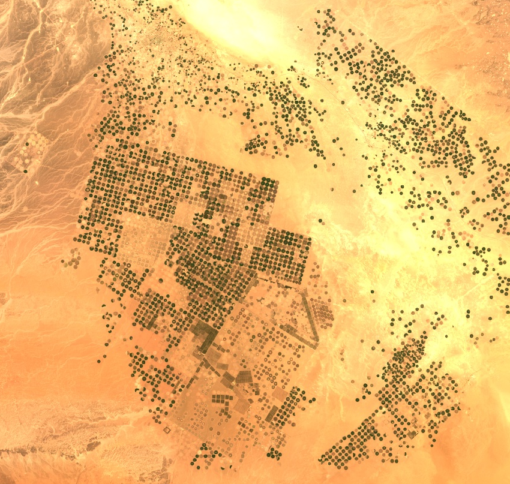

# Our changing planet

Exploring the dramatic changes that take place on our planet over time using satellite images

Inspiration

- [Earth Then and Now by Fred Pearce](https://www.goodreads.com/book/show/27303880-earth-then-and-now)
- [Google Earth Engine Timelapse](https://earthengine.google.com/timelapse)

Data

- [Google Earth Engine Landsat Collection](https://developers.google.com/earth-engine/datasets/catalog/landsat)
- 1991: Landsat 5, Surface Reflectance, RGB, Yearly Median Composite
- 2021: Landsat 8, Surface Reflectance, RGB, Yearly Median Composite

## Drying of Aral Sea, Kazakhstan and Uzbekistan

<table>
	<tr>
		<th>1991</th>
		<th>2021</th>
	</tr>
	<tr>
		<td>  </td>
		<td>  </td>
	</tr>
</table>

## Urban growth in Las Vegas, United States

<table>
	<tr>
		<th>1991</th>
		<th>2021</th>
	</tr>
	<tr>
		<td>  </td>
		<td>  </td>
	</tr>
</table>

## Deforestation in Rio Branco, Brasil

<table>
	<tr>
		<th>1991</th>
		<th>2021</th>
	</tr>
	<tr>
		<td>  </td>
		<td>  </td>
	</tr>
</table>

## Agriculture in Wadi As Sirhan, Saudi Arabia

<table>
	<tr>
		<th>1991</th>
		<th>2021</th>
	</tr>
	<tr>
		<td>  </td>
		<td>  </td>
	</tr>
</table>